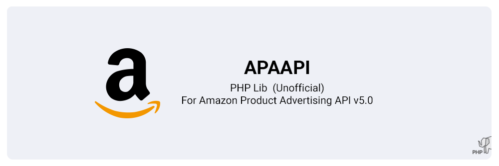
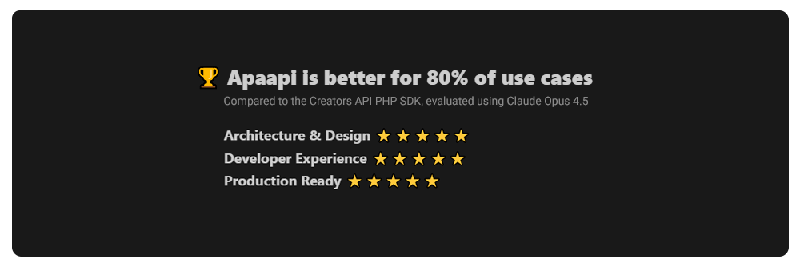

# APAAPI

[](#)

-- Amazon Affiliate With PHP --

Apaapi is an unofficial PHP library for accessing the Amazon Creators API, without relying on the **Amazon SDK**. It is lightweight (~300 KB) and simplifies interaction with the [Amazon Creators API](https://affiliate-program.amazon.com/creatorsapi/docs/), making it easier to integrate Amazon product data into PHP applications.

> [!CAUTION]
> Apaapi 2.x exclusively uses the Amazon Creators API.  
> Support for Apaapi 1.x (PA-API v5) has been discontinued!

## 💡 Features

* **Request Builder** (Easier way to fetch API data).
* **OAuth 2.0**: Implements OAuth 2.0 authentication.
* **Credential-less** (No credentials required using product scraper).
* **Dual HTTP Support** (Auto-detects cURL or Stream fallback for maximum compatibility).
* **Search Filters** (Using builder).
* **Geotargeting** (Automatically redirect links based on the visitor's region).
* **Cart Generator** (Add to cart URL).
* **Rating** (Customer reviews).
* **Response Normalizer** (Normalize response data structure).
* **Response Error Handling** (Including semantic errors with HTTP status code 200).
* **Keyword Converter** (ASIN, ISBN, EAN, Node, Root).
* **Caching System** (Basic built-in cache to reduce API calls).
* **Zero dependencies** (Standalone – No external dependencies required).

[](#)

## ⚡ Installing

#### Using Composer:

```
composer require jakiboy/apaapi
```

#### Without Composer:

* **1** - [Download repository ZIP](https://github.com/Jakiboy/apaapi/archive/refs/heads/main.zip) (*Latest version*).
* **2** - Extract ZIP (*apaapi-main*).
* **3** - Include this lines beelow (*apaapi self-autoloader*).

```
include('apaapi-main/src/Autoloader.php');
\Apaapi\Autoloader::init();
```

* **4** - Use the [Quickstart examples](#quickstart).

## ⚡ Requirements

* **PHP ^8.2**
* **cURL | Stream (file)**

## ⚡ Getting Started

### Variables:

* "CREDENTIAL_ID" : From your Amazon Creators API (*your locale*), [More](https://affiliate-program.amazon.com/creatorsapi/docs/en-us/onboarding/register-for-creators-api). 
* "CREDENTIAL_SECRET" : From your Amazon Creators API (*your locale*), [More](https://affiliate-program.amazon.com/creatorsapi/docs/en-us/onboarding/register-for-creators-api). 
* "TAG" : From your Amazon Associates (*your locale*), [More](https://affiliate-program.amazon.com/creatorsapi/docs/en-us/onboarding/sign-up-as-an-amazon-associate). 
* "LOCALE" : **TLD** of the target marketplace to which you are sending requests (*com/fr/co.jp*), [Get TLD](https://affiliate-program.amazon.com/creatorsapi/docs/en-us/locale-reference). 
* "KEYWORDS" : What you are looking for (*Products*), [More](https://affiliate-program.amazon.com/creatorsapi/docs/en-us/api-reference/resources/search-refinements). 
* "ASIN" : Accepts (ISBN), Amazon Standard Identification Number (*your locale*), [More](https://affiliate-program.amazon.com/creatorsapi/docs/en-us/api-reference/resources/item-info). 
* "NODE" : Browse Node ID (*your locale*), [More](https://affiliate-program.amazon.com/creatorsapi/docs/en-us/api-reference/resources/browse-nodes). 

### Quickstart

**Recommended** using *Apaapi Builder* or *Apaapi Product* (Scraped data) if you dont have API credentials.

[](#Quickstart)

#### Builder:

```php

/**
 * @see Use Composer, 
 * Or include Apaapi Autoloader Here.
 */

use Apaapi\includes\Builder;

// (1) Init request builder
$builder = new Builder('CREDENTIAL_ID', 'CREDENTIAL_SECRET', 'TAG', 'LOCALE');

// (2) Get response (Search)
$data = $builder->searchOne('Sony Xperia 1 VI'); // Normalized array

```

> [!Note]  
> *See full builder usage at [/wiki/Builder](https://github.com/Jakiboy/apaapi/wiki/Builder)* and use case *[/examples](https://github.com/Jakiboy/apaapi/tree/main/examples)*

#### Product:

```php

/**
 * @see Use Composer, 
 * Or include Apaapi Autoloader Here.
 */

use Apaapi\includes\Product;

// (1) Init product
$product = new Product('B00NLZUM36', 'com', 'test-21');

// (2) Get response
$data = $product->get(); // Array

```

> [!Note]  
> *See full product usage at [/wiki/Product](https://github.com/Jakiboy/apaapi/wiki/Product)*
### Rating:

Get customer reviews of product as average rating and count (Scraped data).

[](#Rating)

```php

use Apaapi\includes\Rating;

// Init Rating
$rating = new Rating('B00NLZUM36', 'com', 'test-21');

// Get Response
$data = $rating->get(); // Array

```

### Cart:

Get affiliate cart URL.

[](#Cart)

```php

use Apaapi\lib\Cart;

// Init Cart
$cart = new Cart();
$cart->setLocale('com')->setPartnerTag('test-21');

// Get Response
$data = $cart->set(['B00NLZUM36' => 3]); // String

```

## ⚡ Advanced

### Basic (Search):

Extensible search method.

```php

use Apaapi\operations\SearchItems;
use Apaapi\lib\Request;
use Apaapi\lib\Response;

// (1) Set operation
$operation = new SearchItems();
$operation->setPartnerTag('TAG')->setKeywords('KEYWORDS');

// (2) Prapere request
$request = new Request('CREDENTIAL_ID', 'CREDENTIAL_SECRET');
$request->setLocale('LOCALE')->setPayload($operation);

// (3) Get response
$response = new Response($request);
$data = $response->get(); // Array

```
> [!Note]  
> *See all available TLDs used by setLocale() at [/wiki/TLDs](https://github.com/Jakiboy/apaapi/wiki/TLDs)*

### Basic (Get):

Extensible get method.

```php

use Apaapi\operations\GetItems;
use Apaapi\lib\Request;
use Apaapi\lib\Response;

// Set operation
$operation = new GetItems();
$operation->setPartnerTag('TAG')->setItemIds(['ASIN']);

// Prapere request
$request = new Request('CREDENTIAL_ID', 'CREDENTIAL_SECRET');
$request->setLocale('LOCALE')->setPayload($operation);

// Get response
$response = new Response($request);
$data = $response->get(); // Array

```

### Operations:

All available operations.

```php

use Apaapi\operations\GetItems;
use Apaapi\operations\SearchItems;
use Apaapi\operations\GetVariations;
use Apaapi\operations\GetBrowseNodes;

// (1) GetItems
$operation = new GetItems();
$operation->setPartnerTag('TAG');
$operation->setItemIds(['ASIN']); // Array

// (2) SearchItems
$operation = new SearchItems();
$operation->setPartnerTag('TAG');
$operation->setKeywords('KEYWORDS'); // String

// (3) GetVariations
$operation = new GetVariations();
$operation->setPartnerTag('TAG');
$operation->setASIN('ASIN'); // String

// (4) GetBrowseNodes
$operation = new GetBrowseNodes();
$operation->setPartnerTag('TAG');
$operation->setBrowseNodeIds(['NODE']); // Array

```

### Resources:

Optimize response time by setting only the needed resources.

```php

use Apaapi\operations\SearchItems;

// Set Operation
$operation = new SearchItems();
$operation->setPartnerTag('TAG')->setKeywords('KEYWORDS');

// Set Resources (3)
$operation->setResources(['images.primary.small', 'itemInfo.title', 'offersV2.listings.price']);

```

> [!Note]  
> *See all available resources used by setResources() at [/wiki/Resources](https://github.com/Jakiboy/apaapi/wiki/Resources)*

## Authors

* [Jakiboy](https://github.com/Jakiboy) (*Initial work*)
* [Contributors](https://github.com/Jakiboy/apaapi/graphs/contributors)
* [Any PR is welcome!](./CODE-OF-CONDUCT.md)

### ⭐ Support:

Skip the coffee! If you like the project, a **Star** would mean a lot.

> [!IMPORTANT]  
> *The **Amazon logo** included in top of this page refers only to the [Amazon Creators API](https://affiliate-program.amazon.com/creatorsapi/docs/)*, Amazon Inc. or its affiliates.
